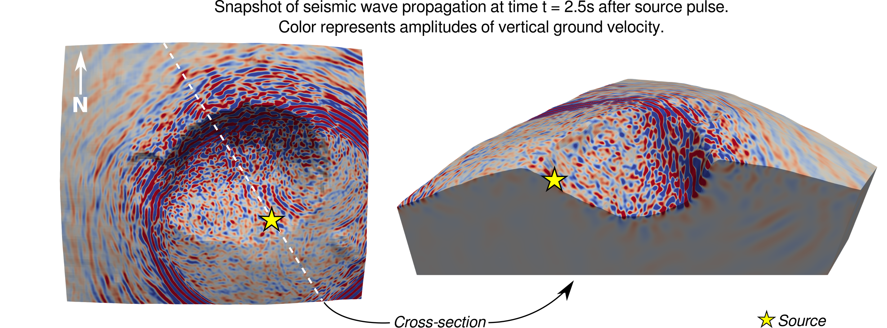

# Rockfall localization

This repository contains an algorithm to localize rockfalls using seismic signals. 

A [Jupyter](https://jupyter.org/) notebook is used to present the localization method. Two exemplary rockfalls which occurred at Dolomieu crater on Piton de la Fournaise volcano, La Réunion, are localized. Downloading the notebook, you can yourself explore the method, interactively pick a time window of the rockfall signal and test the sensitivity of the results in respect to certain parameters. 

In case you don't have Jupyter installed or you want to run the notebook later, you can simply visualize the notebook using `nbviewer` following this [link](https://nbviewer.jupyter.org/github/Jubeku/RF_localization/blob/master/localize.ipynb).
    
The method is based on the comparison of observed and simulated seismic energy ratios between station pairs. In the following, the underlying numerical simulations of the seismic wave propagation are briefly introduced. 

### The simulated data used in the localization method

For simulating the seismic wave propagation the Spectral Element Method (SEM) is used. A numerical domain is created representing the study area. For this, a Digital Elevation Model (DEM) of Dolomieu crater with 10m resolution is used to impose the surface topography. Furthermore, realistic subsurface properties are implemented with the seismic velocity profile proposed by Lesage *et al.* (2018) for the shallow structure of volcanoes. The model is shown in the following image, where the seismic stations are marked by green triangles:

A grid of potential rockfall sources is defined (blue dots on the left figure). The seismic energy recorded at each seismic station (BON, BOR, DSO, SNE) is simulated in respect to each position of the defined grid. The algorithm will compare these simulated energy values to the real signals in order to localize the rockfall.

A snapshot of the simulated wave field from a vertical surface load on the southeastern crater flank is shown in the following image. 

